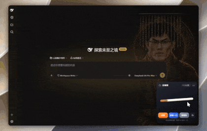

# 云抽烟 ☁️🚬 Cloud Smoke Widget

> 一个跑在 DeepSeek Desktop（DSH）浮层里的「云抽烟」解压小组件：等 AI 跑结果的时候，点根烟打发时间。
> 纯虚拟体验，不鼓励真实吸烟 🚭



## ✨ 特性

- 🔥 **点火 / 掐灭** — 点击香烟点燃，烟头出现火光、火星与脉动光晕
- 💨 **吸烟 / 长按猛吸** — 点按轻吸一口；长按持续猛吸，香烟燃烧更快，烟雾从烟头缓缓飘出
- 🫳 **弹烟灰** — 烟灰随燃烧积累，轻弹掉落在烟灰缸里，烟身还会微微抖动
- ⭕ **吐烟圈** — 烟圈带不规则扰动边缘、内部半透明烟雾层、旋转扩散上升后自然消散
- 📏 **真实燃烧进度** — 烟身随燃烧变短，燃尽后必须「换一根」
- 🎨 **六主题氛围系统** — 每个主题独立背景氛围、光效、香烟配色、文案与烟雾色调，切换带 0.75s 交叉淡入 + 主题色闪光脉冲
- 🎈 **悬浮球模式** — 可收起为悬浮球，拖动到任意位置
- 🕹️ **整体可拖拽** — 按住标题栏拖动卡片

## 🎭 六种主题

| 主题 | 氛围 | 说明 |
| --- | --- | --- |
| 💼 打工人模式 | 冷调办公室光 | 工位上续个命，猛吸一口继续搬砖 |
| 🌙 熬夜赶稿 | 深夜暖灯 + 星光 | 灵感枯竭时的最后一口 |
| 💻 Vibe Coding | 终端绿光 | AI 写码，你抽烟 |
| 🐟 摸鱼解压 | 清新水族馆 | 摸会儿鱼，不着急 |
| 👑 皇帝上朝 | 古风金色殿宇 | 批阅奏折提提神，御笔朱批 |
| 🤖 赛博夜猫子 | 霓虹蓝紫光 + 故障字效 | 深夜超频运行 |

## 🎮 快速体验（无需安装）

打开 [`demo/index.html`](demo/index.html) 即可在浏览器里直接玩（与 DSH 内运行的是同一份源码）。

> 由于浏览器跨域限制，`file://` 直接双击打开会加载失败，请用任意静态服务器打开：
>
> ```bash
> npx serve .        # 然后访问 http://localhost:3000/demo/
> # 或
> python -m http.server
> ```
>
> 如果在仓库 Settings → Pages 启用了 GitHub Pages（选择 `main` 分支），也可以直接在线玩：`https://shuigege2025-dev.github.io/cloud-smoke-widget/demo/`

## 🔌 在 DSH 中一键安装

本插件是一个 **DSH Cordis 客户端插件**，注册在 `shell.overlay` 浮层槽位，需要 DSH 提供 `ctx` / `React` / `styles` 内建与 `slots` / `timer` 服务。

**把下面这条消息复制发给任意 DSH 会话，它会自动下载源码并用 Cordis 定义、运行插件：**

````text
帮我安装这个仓库的 DSH 插件到我的 DSH：https://github.com/shuigege2025-dev/cloud-smoke-widget

安装步骤：
1. 下载插件源码的完整内容：https://raw.githubusercontent.com/shuigege2025-dev/cloud-smoke-widget/main/src/cloud-smoke-widget.js
2. 用 cordis_define 把它定义为新插件：plugin 参数用 {"kind": "new", "idPrefix": "cloudsmoke"}，name 填「云抽烟小组件」，purpose 简述「等待 AI 时的解压互动玩具」，code.client 填第 1 步拿到的完整源码原文
3. 用 cordis_run 运行它：pluginId 和 packageId 填第 2 步返回的值，mode 填 "run"
4. 运行成功后告诉我，组件应出现在 DSH 界面右下角浮层
````

安装成功后，小组件会出现在 DSH 界面的右下角浮层。

> 备选方式：打开 [`src/cloud-smoke-widget.js`](src/cloud-smoke-widget.js) 手动复制全部代码发给 agent，让它「用 Cordis 把这段代码作为客户端插件运行」。

## 📁 目录结构

```
cloud-smoke-widget/
├── src/
│   └── cloud-smoke-widget.js   # 插件源码（自包含：CSS + React 组件 + Cordis 注册）
├── demo/
│   └── index.html              # 纯浏览器演示页（同一份源码）
├── preview/
│   └── cloud-smoking.gif       # 效果动图
├── README.md
└── LICENSE
```

## 🛠️ 技术说明

- 单文件、零依赖的 Cordis 客户端插件：所有样式与逻辑内联在一个文件里
- 通过 `ctx.slots.register({ name: 'shell.overlay', ... })` 挂载到 DSH 浮层
- 依赖服务：`slots`（槽位注册）、`timer`（超时 / 循环定时器）；内置 `makeFallbackTimer()` 降级，脱离 DSH 也能跑（demo 页即利用这一点）
- 烟雾 / 烟圈使用 SVG `feTurbulence` + `feDisplacementMap` 滤镜制造不规则扰动，配合 CSS 关键帧实现漂浮、旋转、扩散与消散
- 燃烧状态机：`burnFront`（燃烧前沿）、`ashLen`（灰烬长度）与燃尽判定由 `timer` 循环驱动

## 📜 License

[MIT](LICENSE) © cloud-smoke-widget contributors
